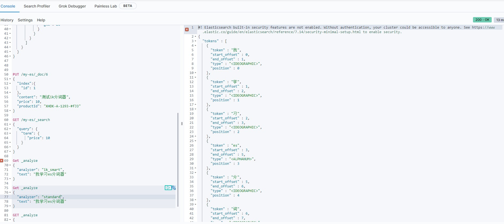
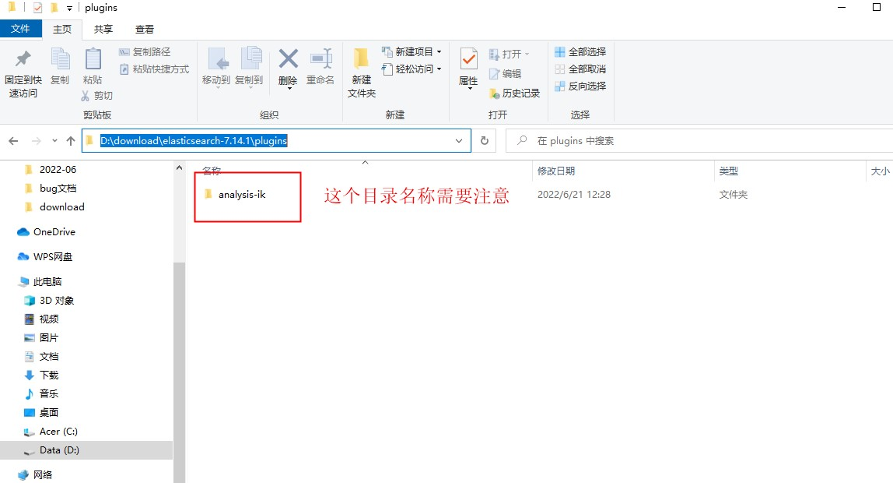
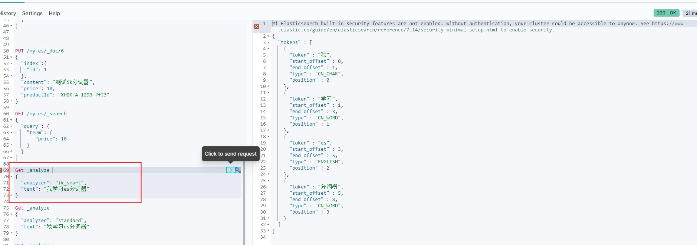
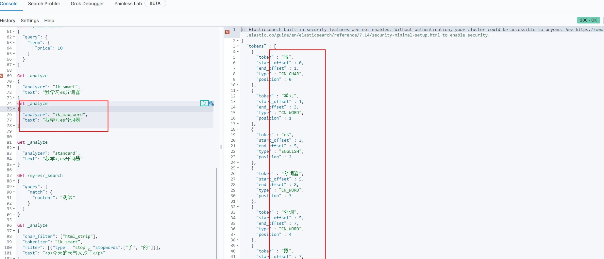

 ## es分词器
### 1 介绍
```xml
   分词(Analysis)是指将一段全文本转换为一系列单词(term)的过程，转换后的单词可用于构建倒排索引。
```
> 分词器: 执行分词过程的插件叫做分词器，由三部分组成:

1 字符过滤器(Character filter) : 对文本中的特殊字符进行转换或过滤，对 html标签过滤掉
2 单词切分器(Tokenizer): 将一段全文切分成多个单词(term),对于英文，可以用空格作为分隔符
3 单词过滤器(Token filter) 切好的单词要经过一系列的token filter的处理


### 2 内置分词器
1 standard 分词器:
> Elasticsearch中的默认分词器，当你没有明确为一个索引字段指定分词器时，那么该字段的分词器就是standard

分词后的效果


2 Ebglish 分词器
> 用于处理英文的分词器,删除了"is"和"for"这两个stopword.


### IK分词器
处理中文的常用的是IK分词器，他是以插件的形式安装后才能使用.
```xml
  https://github.com/medcl/elasticsearch-analysis-ik/releases
```
需要下载和es对应的版本,然后放在es的plugin目录下


使用ik分词器 ik_smart算法进行分词

分词的结果是尽量将文本转换成一组词

使用ik_max_word 算法进行分词


总结: 通过对比可以看出，ik_max_word分词器会尽可能切分出更多的词，但很多词可能与文本的含义并不相关，还是经尽量使用ik_smart作为中文的主要分词器。

ik_smart中文分词器 查询结果

可以查询到对应字段的结果值